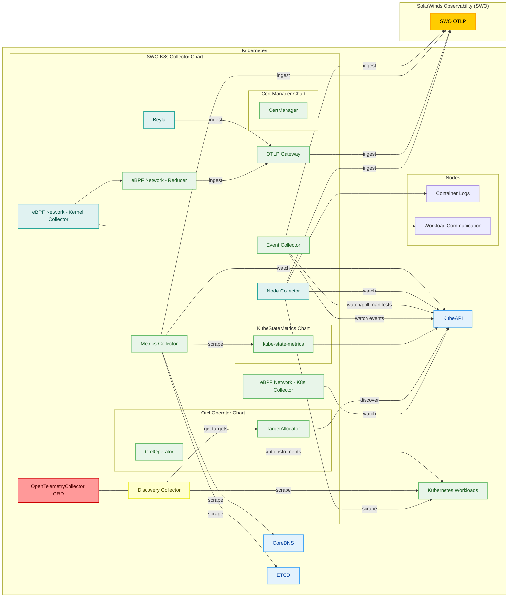

# swo-k8s-collector

## Table of contents

- [Architecture](#architecture)
- [Installation](#installation)
- [Requirements](#requirements)
- [Configuration](#configuration)
- [Features](#features)
  - [Metrics Collection](#metrics-collection)
  - [Logs Collection](#logs-collection)
  - [Events Collection](#events-collection)
  - [Manifests Collection](#events-collection)
  - [APM auto Instrumentation (disabled by default)](#apm-auto-instrumentation-disabled-by-default)
  - [AWS Fargate (disabled by default)](#aws-fargate-disabled-by-default)
  - [eBPF Network Observability](#ebpf-network-observability)
  - [OpenShift Support (disabled by default)](#openshift-support-disabled-by-default)
  - [Auto Update (disabled by default)](#auto-update-disabled-by-default)
- [Receive 3rd party metrics](#receive-3rd-party-metrics)

## Architecture



## Installation

Walk through `Add a Kubernetes cluster` in [SolarWinds Observability](https://documentation.solarwinds.com/en/success_center/observability/default.htm#cshid=gh-k8s-collector)

## Requirements

- Each Kubernetes version is supported for 15 months after its initial release. For example, version 1.27 released on April 11, 2023 is supported until July 11, 2024. For release dates for individual Kubernetes versions, see [Patch Releases](https://kubernetes.io/releases/patch-releases/#detailed-release-history-for-active-branches) in Kubernetes documentation.
  - Local Kubernetes deployments (e.q. Minikube, Docker Desktop) are not supported (although most of the functionality may be working).
  - Note: since Kubernetes v1.24 Docker container runtime will not be reporting pod level network metrics (`kubenet` and other network plumbing was removed from upstream as part of the dockershim removal/deprecation)
- Supported architectures: Linux x86-64 (`amd64`), Linux ARM (`arm64`), Windows x86-64 (`amd64`).
- Helm 3.9.0 or newer.

## Configuration

The [Helm chart](Chart.yaml) that you are about to deploy to your cluster has various configuration options. The full list, including the default settings, is available in [values.yaml](values.yaml).

Internally, it contains [OpenTelemetry Collector configuration](https://opentelemetry.io/docs/collector/configuration/), which defines the metrics and logs to be monitored as well as their preprocessing.

**WARNING: Custom modifications to OpenTelemetry Collector configurations can lead to unexpected `swo-k8s-collector` behavior, data loss, and subsequent entity ingestion failures on the Solarwinds Observability platform side.**

### Mandatory configuration

In order to deploy the Helm chart, you need to prepare:

- A secret called `solarwinds-api-token` with API token for sending data to SolarWinds Observability
- A Helm chart configuration:

  ```yaml
  otel:
      endpoint: <solarwinds-observability-otel-endpoint>
  cluster:
      name: <cluster-display-name>
  ```

#### Version prior to 4.1.0

Before version 4.1.0 setting `cluster.uid` was requried. Starting with version 4.1.0, it became optional. If not provided, it defaults to the value of `cluster.name`.

### How to limit instrumentation of collector

Starting from version 4.4.0, it is possible to specify global namespace filter. You can use `include_namespaces` and `include_namespaces_regex` or `exclude_namespaces` and `exclude_namespaces_regex` conditions, but not `include_` and `exclude_` at the same time. Filter is applied to metrics, events and logs.

  ```yaml
  otel:
      endpoint: <solarwinds-observability-otel-endpoint>
  cluster:
      name: <cluster-display-name>
      filter:
          exclude_namespaces:
              - some-namespace
          exclude_namespaces_regex:
              - "^(dev|stage)-.*"
  ```

  **Note:** Global namespace filter is applied before individual filters mentioned below.

#### Version prior to 4.4.0

There are 5 filters that can to be set to limit the instrumentation of the collector in `values.yaml`. To fully limit the collector to not create entities, you need to set all filters.

- `otel.metrics.filter`
- `otel.metrics.autodiscovery.prometheusEndpoints.filter`
- `otel.events.filter`
- `otel.logs.filter`
- `otel.manifests.filter`

The filter is applied after metric processing, it is the place where metrics could be filtered out. For configuration reference see [Filter Processor documentation](https://github.com/open-telemetry/opentelemetry-collector-contrib/tree/main/processor/filterprocessor).

**Note:** Filtering by labels and annotations is not possible.

Here is example of configuration with all filters. The following example excludes all data from namespaces other than 'foo' and 'bar', but we need to add a condition that allows data without namespace attribute to be collected.

```yaml
otel:
    metrics:
        autodiscovery:  
            prometheusEndpoints:
                filter:
                    metric:
                        - not(IsMatch(resource.attributes["k8s.namespace.name"], "foo|bar") or resource.attributes["k8s.namespace.name"] == nil)
        filter:
            metric:
                - not(IsMatch(resource.attributes["k8s.namespace.name"], "foo|bar") or resource.attributes["k8s.namespace.name"] == nil)
    events:
        filter:
            log_record:
                - not(IsMatch(resource.attributes["k8s.namespace.name"], "foo|bar") or resource.attributes["k8s.namespace.name"] == nil)
    logs:
        filter:
            log_record:
                - not(IsMatch(resource.attributes["k8s.namespace.name"], "foo|bar") or resource.attributes["k8s.namespace.name"] == nil)
    manifests:
        filter:
            log_record:
                - not(IsMatch(resource.attributes["k8s.namespace.name"], "foo|bar") or resource.attributes["k8s.namespace.name"] == nil)
```

Here is an example of a filter that allows all data except data from the namespaces 'foo' and 'bar' to be collected:

```yaml
- IsMatch(resource.attributes["k8s.namespace.name"], "foo|bar")
```

Another example of filter that allows all data except data related to deployment 'foo' and its related entities (pods, containers)

```yaml
- resource.attributes["k8s.deployment.name"] == "foo"
```

## Features

### Metrics Collection

Enabled by default. To disable, set `otel.metrics.enabled: false`.

See [Kubernetes metrics](https://documentation.solarwinds.com/en/success_center/observability/content/intro/kubernetes/metrics.htm) for the list of all metrics exported by the SWO K8s Collector.

#### Metrics from core Kubernetes resources and workloads

The SWO K8s Collector collects metrics from these core Kubernetes resources and workloads using their Prometheus endpoints:

- `kube-state-metrics` - these metrics have prefix `k8s.kube_`
- `cAdvisor` - these metrics have prefix `k8s.container_`
- `apiserver` - these metrics have prefix `k8s.apiserver_`
- `coredns` - enabled through `otel.metrics.control_plane.coredns.enabled`
- `etcd` - enabled through `otel.metrics.control_plane.etcd.enabled`
- `controller_manager` - enabled through `otel.metrics.control_plane.controller_manager.enabled`
- `certmanager`

The SWO K8s Collector also creates some additional metrics using the metrics above. These metrics have prefixes:

- `k8s.cluster.`
- `k8s.node.`
- `k8s.deployment.`
- `k8s.kube.job`
- `k8s.persistentvolume.`
- `k8s.persistentvolumeclaim.`
- `k8s.pod.`
- `k8s.container.`
- `k8s.apiserver.`

#### Application metrics from their Prometheus metrics endpoints

##### Annotation based discovery

Enabled by default. To disable, set `otel.metrics.autodiscovery.prometheusEndpoints.enabled: false`.

SWO K8s Collector performs discovery of application Prometheus endpoints, based on the following annotations on the workloads:

- `prometheus.io/scrape` - enable/disable collection
- `prometheus.io/scheme` - one of `http`/`https` (default `http`)
- `prometheus.io/path` - path of Prometheus endpoint (default `/metrics`)
- `prometheus.io/port` - port of Prometheus endpoint (default `9090`)

Additional discovery rules can be configured using `otel.metrics.autodiscovery.prometheusEndpoints.additionalRules` (see settings in the `otel.metrics.autodiscovery.prometheusEndpoints` section of the [values.yaml](values.yaml)).

##### Discovery based on Pod/Service monitors

SWO K8s Collector can discover Prometheus Operator CRDs (`ServiceMonitors`, `PodMonitors`, `ScrapeConfigs`, and `Probes`) and scrape Prometheus endpoints based on them.

Internally, it leverages the [TargetAllocator](https://opentelemetry.io/docs/platforms/kubernetes/operator/target-allocator/) feature of the OpenTelemetry Operator.

Keep in mind that there can be duplicate scrapes of the same targets if the [Annotation based discovery](#annotation-based-discovery)is enabled (which is the default). To avoid duplicate scrapes, it is recommended to disable the default discovery and also set the `sw.ignore=true` label on all CRDs that are already monitored by default by the SWO K8s Collector (kubelet metrics, kube-state-metrics, apiserver).

Configuration:

1. Enable deployment of the operator

    The same as in [APM auto Instrumentation (disabled by default)](#apm-auto-instrumentation-disabled-by-default).

2. Ensure proper TLS Certificate management

    The same as in [APM auto Instrumentation (disabled by default)](#apm-auto-instrumentation-disabled-by-default).

3. Deploy Prometheus Operator CRDs

    Set `prometheusCRDs.install=true` in `values.yaml`.

4. Enable Discovery Collector

    Set `otel.metrics.autodiscovery.discovery_collector.enabled=true` in `values.yaml`.

5. Configure the right selectors for Prometheus CRDs

    By default, all CRDs that do not have the `sw.ignore=true` label are discovered. This can be overridden by the following configuration in `values.yaml`:

    ```yaml
    otel:
      metrics:
        autodiscovery:
          discovery_collector:
            targetAllocator:
              # see https://github.com/open-telemetry/opentelemetry-operator/blob/main/docs/api/opentelemetrycollectors.md#opentelemetrycollectorspectargetallocatorprometheuscrservicemonitorselector
              serviceMonitorSelector: {}
              # see https://github.com/open-telemetry/opentelemetry-operator/blob/main/docs/api/opentelemetrycollectors.md#opentelemetrycollectorspectargetallocatorprometheuscrpodmonitorselector
              podMonitorSelector: {}
              # see https://github.com/open-telemetry/opentelemetry-operator/blob/main/docs/api/opentelemetrycollectors.md#opentelemetrycollectorspectargetallocatorprometheuscrprobeselector
              probeSelector: {}
              # see https://github.com/open-telemetry/opentelemetry-operator/blob/main/docs/api/opentelemetrycollectors.md#opentelemetrycollectorspectargetallocatorprometheuscrscrapeconfigselector
              scrapeConfigSelector: {}
    ```

### Logs Collection

Enabled by default. To disable, set `otel.logs.enabled: false`.

The following kinds of logs are collected:

#### Container logs

To disable, set: `otel.logs.container: false`.

Each log has the following attributes so they can be filtered out by them using filter configuration:

- `sw.k8s.log.type`=`container`
- `k8s.cluster.name` - name of the cluster (input generated during onboarding)
- `sw.k8s.agent.manifest.version` - version of the manifest
- `k8s.node.name` - node from which the container logs are coming from
- `k8s.container.name` - name of the container that is reporting logs
- `k8s.namespace.name` - namespace of the container
- `k8s.pod.name` - pod of the container
- `run_id` - id of the container run
- `k8s.pod.uid` - pod's UID

#### Journal logs

To disable, set: `otel.logs.journal: false`.

Each log has following attributes so they can be filtered out by them using filter configuration:

- `sw.k8s.log.type`=`journal`
- `k8s.cluster.name` - name of the cluster (input generated during onboarding)
- `sw.k8s.agent.manifest.version` - version of the manifest
- `k8s.node.name` - node from which the journal logs are coming from

#### Behavior since version v4.x

The `swo-k8s-collector` collects all logs by default which might be intensive. To avoid processing an excessive amount of data, the `swo-k8s-collector` can define filter which will drop all unwanted logs. This behavior can be modified by setting `otel.logs.filter` value.

An example for scraping container logs only from `kube-*` namespace:

```yaml
otel:
  logs:
    filter:
      log_record:
        - not(IsMatch(resource.attributes["k8s.namespace.name"], "^kube-.*$"))
```

An example for scraping container logs only from namespaces `my-custom-namespace` or `my-other-namespace` while excluding istio logs related to some of the successful HTTP requests:

```yaml
otel:
  logs:
    filter:
      log_record:
        - not(IsMatch(resource.attributes["k8s.namespace.name"], "(^my-custom-namespace$)|(^my-other-namespace$)"))
        - |
          resource.attributes["k8s.container.name"] == "istio-proxy" and
          IsMatch(body, "\\[[^\\]]*\\] \"\\S+ \\S+ HTTP/\\d(\\.\\d)*\" 200.*")
```

#### Behavior in version v3.x

The `swo-k8s-collector` collects container logs only in `kube-*` namespaces, which means it only collects logs from the internal Kubernetes container. This behavior can be modified by setting `otel.logs.filter` value. An example for scraping logs from all namespaces:

```yaml
otel:
  logs:
    filter:
      include:
        match_type: regexp
        record_attributes:
          - key: k8s.namespace.name
            value: ^.*$
```

### Events Collection

Enabled by default. To disable, set `otel.events.enabled: false`.

The `swo-k8s-collector` collects all Kubernetes events from the cluster and emits them as OTEL logs to SWO. Each event has following attributes:

- `k8s.cluster.name` - name of the cluster (input generated during onboarding)
- `sw.k8s.agent.manifest.version` - version of the manifest
- `k8s.object.name` - name of the resource that triggered event
- `k8s.object.kind` - type of the resource that triggered event (e.g. `Pod`, `Deployment` etc.)
- `k8s.<workload>.name` - following OTEL semantics, `<workload>` is the type of workload (the value equals to value of `k8s.object.name`)
- `k8s.namespace.name` - namespace of the resource that triggered event
- `k8s.object.uid` - UID of the resource that triggered event
- `k8s.object.fieldpath` - value of `FieldPath` of the resource that triggered event
- `k8s.object.api_version` - APIVersion of the resource that triggered event
- `k8s.object.resource_version` - resource version of the resource that triggered event
- `sw.k8s.log.type`=`event`
- `k8s.event.reason` - event reason
- `k8s.event.action` - event action
- `k8s.event.start_time` - time of event trigger
- `k8s.event.name` - name of the event
- `k8s.event.uid` - event UID
- `k8s.event.count` - how many times the event has been triggered

### Manifests Collection

Enabled by default. To disable, set `otel.manifests.enabled: false`.

Starting with version 4.0.0, `swo-k8s-collector` observes changes in supported resources and collects their manifests.

Manifest collection runs in the event collector, so `otel.events.enabled` must be set to `true` (default).

Currently, the following resources are watched for changes:

- `pods`
- `deployments`
- `statefulsets`
- `replicasets`
- `daemonsets`
- `jobs`
- `cronjobs`
- `nodes`
- `services`
- `persistentvolumes`
- `persistentvolumeclaims`
- `ingresses`
- `configmaps`
- `namespaces`
- `virtualservices`
- `roles`
- `rolebindings`
- `clusterroles`
- `clusterrolebindings`
- `serviceaccounts`

Use the `otel.manifests.filter` setting to filter out manifests that should not be collected.

An example of filter for collecting all manifests, but `configmaps` just for `kube-system` namespace:

```yaml
otel:
  manifests:
    enabled: true
    filter:
      log_record:  
        - attributes["k8s.object.kind"] == "ConfigMap" and resource.attributes["k8s.namespace.name"] != "kube-system"
```

### APM auto Instrumentation (disabled by default)

This chart allows you to deploy the [OpenTelemetry Operator](https://github.com/open-telemetry/opentelemetry-operator), which can be used to auto-instrument applications with [SWO APM](https://documentation.solarwinds.com/en/success_center/observability/content/intro/services.htm).

Configuration:

1. Enable deployment of the operator

    Set the following option in `values.yaml`: `operator.enable=true`

2. Ensure proper TLS Certificate management

    The operator expects that Cert Manager is already present on the cluster. There are a few different ways you can use to generate/configure the required TLS certificate:

      - Deploy `cert-manager` as part of this chart.
        - Ensure there is no cert-manager instance already present in the cluster.
        - Set `certmanager.enabled=true`.
      - Or, read the [OTEL Operator documentation for alternative options](https://opentelemetry.io/docs/kubernetes/helm/operator/#configuration). All OTEL Operator configuration options are available below the `operator` key in `values.yaml`.

3. Create an `Instrumentation` custom resource

    - Create an `Instrumentation` custom resource.
    - Set `SW_APM_SERVICE_KEY` with the SWO ingestion API token. You can use the same token that is used for this chart.
    - Set `SW_APM_COLLECTOR` with the APM SWO endpoint (e.g., `apm.collector.na-01.cloud.solarwinds.com`).
    - If you are using a secret to store the API token, both the secret and the `Instrumentation` resource must be created in the same namespace as the applications that are to be instrumented.
    - Example:

      ```yaml
      apiVersion: opentelemetry.io/v1alpha1
      kind: Instrumentation
      metadata:
        name: swo-apm-instrumentation
      spec:
        java:
          env:
            - name: SW_APM_SERVICE_KEY
              valueFrom:
                secretKeyRef:
                  name: solarwinds-api-token
                  key: SOLARWINDS_API_TOKEN
            - name: SW_APM_COLLECTOR
              value: apm.collector.na-01.cloud.solarwinds.com
      ```

4. Instrument applications by setting the annotation

    The final step is to opt your services into automatic instrumentation. This is done by updating your service’s `spec.template.metadata.annotations` to include a language-specific annotation:

    - .NET: `instrumentation.opentelemetry.io/inject-dotnet: "true"`
    - Go: `instrumentation.opentelemetry.io/inject-go: "true"`
    - Java: `instrumentation.opentelemetry.io/inject-java: "true"`
    - Node.js: `instrumentation.opentelemetry.io/inject-nodejs: "true"`
    - Python: `instrumentation.opentelemetry.io/inject-python: "true"`

    The possible values for the annotation can be:

    - `"true"` - to inject the Instrumentation resource with the default name from the current namespace.
    - `"my-instrumentation"` - to inject the Instrumentation CR instance with the name "my-instrumentation" in the current namespace.
    - `"my-other-namespace/my-instrumentation"` - to inject the Instrumentation CR instance with the name "my-instrumentation" from another namespace "my-other-namespace".
    - `"false"` - do not inject.

    Alternatively, the annotation can be added to a namespace, which will result in all services in that namespace opting into automatic instrumentation. See the [Operator's auto-instrumentation documentation](https://github.com/open-telemetry/opentelemetry-operator/blob/main/README.md#opentelemetry-auto-instrumentation-injection) for more details.

### AWS Fargate (disabled by default)

SWO K8s Collector must be instructed that it runs in AWS Fargate with `aws_fargate.enabled: true`.
It makes sure that no operation is dependent on DaemonSets (metrics and logs), which are not supported on Fargate Nodes.

To collect logs from Fargate, set setting `aws_fargate.logs.enabled: true` and follow [this documentation](https://documentation.solarwinds.com/en/success_center/observability/content/configure/configure-logs-k8s-fargate.htm)

### eBPF Network Observability

Enabled by default. To disable, set `ebpfNetworkMonitoring.enabled: false`.

The SWO K8s Collector collects metrics about network communication between workloads. This enables network topology mapping.

### OpenShift Support (disabled by default)

Adds support for OpenShift-specific configurations.

To enable, set `openshift.enabled: true`.

### Auto Update (disabled by default)

Automatically updates the Helm chart to the latest version.

To enable, set `autoupdate.enabled: true`.

## Receive 3rd party metrics

SWO K8s Collector has an OTEL service endpoint which is able to forward metrics, logs and traces into SolarWinds Observability. All incoming data is properly associated with current cluster. Additionally, metrics are decorated by default with prefix `k8s.` (prefix can be configured).

Service endpoint is provided in format

```text
"<chart-name>-gateway.<namespace>.svc.cluster.local:4317"
```

### OpenTelemetry Collector configuration example

In case you want to send data from your own [OpenTelemetry Collector](https://github.com/open-telemetry/opentelemetry-collector-contrib) into SWO you can either send them directly into [public OTLP endpoint](https://documentation.solarwinds.com/en/success_center/observability/content/configure/configure-otel-directly.htm) or you can send them via our `swo-k8s-collector` to have better binding to other data available in SolarWinds Observability. To do that add following exporter into your configuration.

```yaml
config:
  exporters:
    otlp:
      endpoint: <chart-name>-metrics-collector.<namespace>.svc.cluster.local:4317
```

### Telegraf configuration example

[Telegraf](https://github.com/influxdata/telegraf) is a plugin-driven server agent used for collecting and reporting metrics.

Telegraf metrics can be sent into our endpoint by adding following fragment to your `values.yaml`

```yaml
config:
  outputs:
    - opentelemetry:
        service_address: <chart-name>-metrics-collector.<namespace>.svc.cluster.local:4317
```
