# Collector pipeline

The `swo-k8s-collector` Helm chart deploys several k8s workflows. The following chart shows dataflows inside the deployed OTEL collectors: `MetricsCollector Deployment`, `MetricsDiscovery Deployment`, `EventsCollector Deployment`, `NodeCollector DaemonSet`, and `Gateway Collector Deployment`.

Note: Some of the pipelines may not be actually utilized, depending on the environment and the Helm chart's settings provided during its installation.

```mermaid
stateDiagram-v2
%%
%% ──────────────────────────────────────────────────────────────────────────────
%%  METRICS COLLECTOR
%% ──────────────────────────────────────────────────────────────────────────────
  metricsCollectorDeployment: MetricsCollector Deployment
  state metricsCollectorDeployment {

    mc_metricsPipeline: 'metrics' pipeline
    state mc_metricsPipeline {
      mc_r1: 'forward/metric-exporter' connector
      mc_e1: 'otlp' exporter
      mc_r1 --> mc_e1 : processors
    }

    mc_metricsKubestatemetricsPipeline: 'metrics/kubestatemetrics' pipeline
    state mc_metricsKubestatemetricsPipeline {
      mc_r2: 'prometheus/kube-state-metrics' receiver
      mc_e2: 'forward/prometheus' connector
      mc_r2 --> mc_e2 : processors
    }

    mc_metricsPrometheusPipeline: 'metrics/prometheus' pipeline
    state mc_metricsPrometheusPipeline {
      mc_r4: 'forward/prometheus' connector
      mc_e4: 'forward/metric-exporter' connector
      mc_r4 --> mc_e4 : processors
    }

    mc_metricsPrometheusNodeMetricsPipeline: 'metrics/prometheus-node-metrics' pipeline
    state mc_metricsPrometheusNodeMetricsPipeline {
      mc_r5: 'prometheus/node-metrics' receiver
      mc_e5: 'forward/prometheus' connector
      mc_r5 --> mc_e5 : processors
    }

    mc_metricsPrometheusServerPipeline: 'metrics/prometheus-server' pipeline
    state mc_metricsPrometheusServerPipeline {
      mc_r6: 'prometheus/prometheus-server' receiver
      mc_e6: 'forward/prometheus' connector
      mc_r6 --> mc_e6 : processors
    }

    mc_metricsKubestatemetricsPipeline --> mc_metricsPrometheusPipeline
    mc_metricsPrometheusNodeMetricsPipeline --> mc_metricsPrometheusPipeline
    mc_metricsPrometheusServerPipeline --> mc_metricsPrometheusPipeline
    mc_metricsPrometheusPipeline --> mc_metricsPipeline
  }

%% ──────────────────────────────────────────────────────────────────────────────
%%  METRICS-DISCOVERY COLLECTOR
%% ──────────────────────────────────────────────────────────────────────────────
  metricsDiscoveryDeployment: MetricsDiscovery Deployment
  state metricsDiscoveryDeployment {

    md_metricsDiscoveryScrapePipeline: 'metrics/discovery-scrape' pipeline
    state md_metricsDiscoveryScrapePipeline {
      md_r1: 'receiver_creator/discovery' receiver
      md_e1: 'routing/discovered_metrics' connector
      md_r1 --> md_e1 : processors
    }

    md_metricsDiscoveryIstioPipeline: 'metrics/discovery-istio' pipeline
    state md_metricsDiscoveryIstioPipeline {
      md_r2: 'routing/discovered_metrics' connector
      md_e2a: 'forward/metric-exporter' connector
      md_e2b: 'forward/relationship-state-events-workload-workload' connector
      md_e2c: 'forward/relationship-state-events-workload-service' connector
      md_r2 --> md_e2a : processors
      md_r2 --> md_e2b : processors
      md_r2 --> md_e2c : processors
    }

    md_metricsRelationshipWorkloadPipeline: 'metrics/relationship-state-events-workload-workload-preparation' pipeline
    state md_metricsRelationshipWorkloadPipeline {
      md_r3: 'forward/relationship-state-events-workload-workload' connector
      md_e3: 'solarwindsentity/istio-workload-workload' connector
      md_r3 --> md_e3 : processors
    }

    md_metricsRelationshipServicePipeline: 'metrics/relationship-state-events-workload-service-preparation' pipeline
    state md_metricsRelationshipServicePipeline {
      md_r4: 'forward/relationship-state-events-workload-service' connector
      md_e4: 'solarwindsentity/istio-workload-service' connector
      md_r4 --> md_e4 : processors
    }

    md_logsStateEventsEntitiesPipeline: 'logs/stateevents-entities' pipeline
    state md_logsStateEventsEntitiesPipeline {
      md_r5a: 'solarwindsentity/istio-workload-workload' connector
      md_r5b: 'solarwindsentity/istio-workload-service' connector
      md_e5a: 'otlp' exporter
      md_r5a --> md_e5a : processors
      md_r5b --> md_e5a : processors
    }

    md_logsStateEventsRelationshipsPipeline: 'logs/stateevents-relationships' pipeline
    state md_logsStateEventsRelationshipsPipeline {
      md_r6a: 'solarwindsentity/istio-workload-workload' connector
      md_r6b: 'solarwindsentity/istio-workload-service' connector
      md_e6a: 'otlp' exporter
      md_r6a --> md_e6a : processors
      md_r6b --> md_e6a : processors
    }

    md_metricsDiscoveryCustomPipeline: 'metrics/discovery-custom' pipeline
    state md_metricsDiscoveryCustomPipeline {
      md_r7: 'routing/discovered_metrics' connector
      md_e7: 'forward/metric-exporter' connector
      md_r7 --> md_e7 : processors
    }

    md_metricsPipeline: 'metrics' pipeline
    state md_metricsPipeline {
      md_r8: 'forward/metric-exporter' connector
      md_e8: 'otlp' exporter
      md_r8 --> md_e8 : processors
    }

    md_metricsDiscoveryScrapePipeline --> md_metricsDiscoveryCustomPipeline
    md_metricsDiscoveryScrapePipeline --> md_metricsDiscoveryIstioPipeline
    md_metricsDiscoveryIstioPipeline --> md_metricsRelationshipWorkloadPipeline
    md_metricsDiscoveryIstioPipeline --> md_metricsRelationshipServicePipeline
    md_metricsRelationshipWorkloadPipeline --> md_logsStateEventsEntitiesPipeline
    md_metricsRelationshipServicePipeline --> md_logsStateEventsEntitiesPipeline
    md_metricsRelationshipWorkloadPipeline --> md_logsStateEventsRelationshipsPipeline
    md_metricsRelationshipServicePipeline --> md_logsStateEventsRelationshipsPipeline
    md_metricsDiscoveryCustomPipeline --> md_metricsPipeline
    md_metricsDiscoveryIstioPipeline --> md_metricsPipeline
  }

%% ──────────────────────────────────────────────────────────────────────────────
%%  EVENTS COLLECTOR
%% ──────────────────────────────────────────────────────────────────────────────
  eventsCollectorDeployment: EventsCollector Deployment
  state eventsCollectorDeployment {

    ec_logsPipeline: 'logs' pipeline
    state ec_logsPipeline {
      ec_r1: 'k8s_events' receiver
      ec_e1: 'otlp' exporter
      ec_r1 --> ec_e1 : processors
    }

    ec_manifestsPipeline: 'logs/manifests' pipeline
    state ec_manifestsPipeline {
      ec_r2: 'swok8sobjects' receiver
      ec_e2: 'otlp' exporter
      ec_r2 --> ec_e2 : processors
    }

    ec_manifestsKeepalivePipeline: 'logs/manifests-keepalive' pipeline
    state ec_manifestsKeepalivePipeline {
      ec_r3: 'swok8sobjects/keepalive' receiver
      ec_e3: 'solarwindsentity/keepalive' exporter
      ec_r3 --> ec_e3 : processors
    }

    ec_logsStateEventsPipeline: 'logs/stateevents' pipeline
    state ec_logsStateEventsPipeline {
      ec_r4: 'solarwindsentity/keepalive' connector
      ec_e4: 'otlp' exporter
      ec_r4 --> ec_e4 : processors
    }

    ec_manifestsKeepalivePipeline --> ec_logsStateEventsPipeline
  }

%% ──────────────────────────────────────────────────────────────────────────────
%%  GATEWAY COLLECTOR
%% ──────────────────────────────────────────────────────────────────────────────
  gatewayCollectorDeployment: Gateway Collector Deployment
  state gatewayCollectorDeployment {

    gw_metricsCommonInPipeline: 'metrics/common_in' pipeline
    state gw_metricsCommonInPipeline {
      gw_mr1: 'otlp' receiver
      gw_me1: 'routing/metrics' connector
      gw_mr1 --> gw_me1 : processors
    }

    gw_metricsPipeline: 'metrics' pipeline
    state gw_metricsPipeline {
      gw_mr2: 'routing/metrics' connector
      gw_me2: 'forward/metrics_common' connector
      gw_mr2 --> gw_me2 : processors
    }

    gw_metricsBeylaPipeline: 'metrics/beyla' pipeline
    state gw_metricsBeylaPipeline {
      gw_mr3: 'routing/metrics' connector
      gw_me3: 'forward/metrics_common' connector
      gw_mr3 --> gw_me3 : processors
    }

    gw_metricsCommonOutPipeline: 'metrics/common_out' pipeline
    state gw_metricsCommonOutPipeline {
      gw_mr4: 'forward/metrics_common' connector
      gw_me4: 'otlp' exporter
      gw_mr4 --> gw_me4 : processors
    }

    gw_metricsBeylaNetworkEntitiesPipeline: 'metrics/beyla-network-entities-and-relationships' pipeline
    state gw_metricsBeylaNetworkEntitiesPipeline {
      gw_mr5: 'routing/metrics' connector
      gw_me5a: 'solarwindsentity/beyla-relationships' exporter
      gw_me5b: 'solarwindsentity/beyla-entities' exporter
      gw_mr5 --> gw_me5a : processors
      gw_mr5 --> gw_me5b : processors
    }

    gw_logsBeylaStateEventsEntitiesPipeline: 'logs/beyla-stateevents-entities' pipeline
    state gw_logsBeylaStateEventsEntitiesPipeline {
      gw_lr1: 'solarwindsentity/beyla-entities' receiver
      gw_le1: 'otlp' exporter
      gw_lr1 --> gw_le1 : processors
    }

    gw_logsBeylaStateEventsRelationshipsPipeline: 'logs/beyla-stateevents-relationships' pipeline
    state gw_logsBeylaStateEventsRelationshipsPipeline {
      gw_lr2: 'solarwindsentity/beyla-relationships' receiver
      gw_le2: 'otlp' exporter
      gw_lr2 --> gw_le2 : processors
    }

    gw_logsPipeline: 'logs' pipeline
    state gw_logsPipeline {
      gw_lr3: 'otlp' receiver
      gw_le3: 'otlp' exporter
      gw_lr3 --> gw_le3 : processors
    }

    gw_tracesPipeline: 'traces' pipeline
    state gw_tracesPipeline {
      gw_tr: 'otlp' receiver
      gw_te: 'otlp' exporter
      gw_tr --> gw_te : processors
    }

    gw_metricsCommonInPipeline --> gw_metricsPipeline
    gw_metricsCommonInPipeline --> gw_metricsBeylaPipeline
    gw_metricsCommonInPipeline --> gw_metricsBeylaNetworkEntitiesPipeline
    gw_metricsPipeline --> gw_metricsCommonOutPipeline
    gw_metricsBeylaPipeline --> gw_metricsCommonOutPipeline
    gw_metricsBeylaNetworkEntitiesPipeline --> gw_logsBeylaStateEventsEntitiesPipeline
    gw_metricsBeylaNetworkEntitiesPipeline --> gw_logsBeylaStateEventsRelationshipsPipeline
  }

%% ──────────────────────────────────────────────────────────────────────────────
%%  OTHER COMPONENTS
%% ──────────────────────────────────────────────────────────────────────────────
  kubestatemetricsDeployment: KubeStateMetrics Deployment
  ebpfreducerDeployment: eBPF Reducer Deployment
  beylaComponent: Beyla Auto-Instrumentation

  kubestatemetricsDeployment --> mc_metricsKubestatemetricsPipeline
  ebpfreducerDeployment --> gw_metricsCommonInPipeline
  beylaComponent --> gw_metricsCommonInPipeline : traces/metrics

%% ──────────────────────────────────────────────────────────────────────────────
%%  NODE COLLECTOR
%% ──────────────────────────────────────────────────────────────────────────────
  nodeCollectorDaemonset: NodeCollector DaemonSet
  state nodeCollectorDaemonset {

    nc_logsPipeline: 'logs' pipeline
    state nc_logsPipeline {
      nc_r1: 'forward/logs-exporter' connector
      nc_e1: 'otlp' exporter
      nc_r1 --> nc_e1 : processors
    }

    nc_logsContainerPipeline: 'logs/container' pipeline
    state nc_logsContainerPipeline {
      nc_r2: 'filelog' receiver
      nc_e2: 'forward/logs-exporter' connector
      nc_r2 --> nc_e2 : processors
    }

    nc_logsJournalPipeline: 'logs/journal' pipeline
    state nc_logsJournalPipeline {
      nc_r3: 'journald' receiver
      nc_e3: 'forward/logs-exporter' connector
      nc_r3 --> nc_e3 : processors
    }

    nc_metricsPipeline: 'metrics' pipeline
    state nc_metricsPipeline {
      nc_r4: 'forward/metric-exporter' connector
      nc_e4: 'otlp' exporter
      nc_r4 --> nc_e4 : processors
    }

    nc_metricsDiscoveryScrapePipeline: 'metrics/discovery-scrape' pipeline
    state nc_metricsDiscoveryScrapePipeline {
      nc_r5: 'receiver_creator/discovery' receiver
      nc_e5: 'routing/discovered_metrics' connector
      nc_r5 --> nc_e5 : processors
    }

    nc_metricsDiscoveryIstioPipeline: 'metrics/discovery-istio' pipeline
    state nc_metricsDiscoveryIstioPipeline {
      nc_r6: 'routing/discovered_metrics' connector
      nc_e6a: 'forward/metric-exporter' connector
      nc_e6b: 'forward/relationship-state-events-workload-workload' connector
      nc_e6c: 'forward/relationship-state-events-workload-service' connector
      nc_r6 --> nc_e6a : processors
      nc_r6 --> nc_e6b : processors
      nc_r6 --> nc_e6c : processors
    }

    nc_metricsRelationshipWorkloadPipeline: 'metrics/relationship-state-events-workload-workload-preparation' pipeline
    state nc_metricsRelationshipWorkloadPipeline {
      nc_r7: 'forward/relationship-state-events-workload-workload' connector
      nc_e7: 'solarwindsentity/istio-workload-workload' connector
      nc_r7 --> nc_e7 : processors
    }

    nc_metricsRelationshipServicePipeline: 'metrics/relationship-state-events-workload-service-preparation' pipeline
    state nc_metricsRelationshipServicePipeline {
      nc_r8: 'forward/relationship-state-events-workload-service' connector
      nc_e8: 'solarwindsentity/istio-workload-service' connector
      nc_r8 --> nc_e8 : processors
    }

    nc_logsStateEventsEntitiesPipeline: 'logs/stateevents-entities' pipeline
    state nc_logsStateEventsEntitiesPipeline {
      nc_r9a: 'solarwindsentity/istio-workload-workload' connector
      nc_r9b: 'solarwindsentity/istio-workload-service' connector
      nc_e9a: 'otlp' exporter
      nc_r9a --> nc_e9a : processors
      nc_r9b --> nc_e9a : processors
    }

    nc_logsStateEventsRelationshipsPipeline: 'logs/stateevents-relationships' pipeline
    state nc_logsStateEventsRelationshipsPipeline {
      nc_r10a: 'solarwindsentity/istio-workload-workload' connector
      nc_r10b: 'solarwindsentity/istio-workload-service' connector
      nc_e10a: 'otlp' exporter
      nc_r10a --> nc_e10a : processors
      nc_r10b --> nc_e10a : processors
    }

    nc_metricsDiscoveryCustomPipeline: 'metrics/discovery-custom' pipeline
    state nc_metricsDiscoveryCustomPipeline {
      nc_r11: 'routing/discovered_metrics' connector
      nc_e11: 'forward/metric-exporter' connector
      nc_r11 --> nc_e11 : processors
    }

    nc_metricsNodePipeline: 'metrics/node' pipeline
    state nc_metricsNodePipeline {
      nc_r12: 'receiver_creator/node' receiver
      nc_e12: 'forward/metric-exporter' connector
      nc_r12 --> nc_e12 : processors
    }

    nc_logsContainerPipeline --> nc_logsPipeline
    nc_logsJournalPipeline --> nc_logsPipeline

    nc_metricsDiscoveryScrapePipeline --> nc_metricsDiscoveryCustomPipeline
    nc_metricsDiscoveryScrapePipeline --> nc_metricsDiscoveryIstioPipeline
    nc_metricsDiscoveryIstioPipeline --> nc_metricsRelationshipWorkloadPipeline
    nc_metricsDiscoveryIstioPipeline --> nc_metricsRelationshipServicePipeline
    nc_metricsRelationshipWorkloadPipeline --> nc_logsStateEventsEntitiesPipeline
    nc_metricsRelationshipServicePipeline --> nc_logsStateEventsEntitiesPipeline
    nc_metricsRelationshipWorkloadPipeline --> nc_logsStateEventsRelationshipsPipeline
    nc_metricsRelationshipServicePipeline --> nc_logsStateEventsRelationshipsPipeline

    nc_metricsDiscoveryCustomPipeline --> nc_metricsPipeline
    nc_metricsNodePipeline --> nc_metricsPipeline
    nc_metricsDiscoveryIstioPipeline --> nc_metricsPipeline
  }
```

## Pipeline Overview

### MetricsCollector Deployment
- **metrics pipeline**: Main pipeline that exports metrics via OTLP
- **metrics/kubestatemetrics pipeline**: Collects metrics from the Kube State Metrics service
- **metrics/prometheus pipeline**: Processes Prometheus-formatted metrics and forwards them to the main metrics pipeline
- **metrics/prometheus-node-metrics pipeline**: Collects node-level metrics in Prometheus format
- **metrics/prometheus-server pipeline**: Collects metrics from the Prometheus server (optional)

### MetricsDiscovery Deployment
- **metrics/discovery-scrape pipeline**: Discovers and collects metrics from annotated pods using the receiver_creator and k8s_observer
- **metrics/discovery-istio pipeline**: Processes Istio-specific metrics and generates relationship events
- **metrics/discovery-custom pipeline**: Processes general discovered metrics
- **metrics/relationship-state-events-workload-workload-preparation pipeline**: Prepares workload-to-workload relationship events
- **metrics/relationship-state-events-workload-service-preparation pipeline**: Prepares workload-to-service relationship events
- **logs/stateevents-entities pipeline**: Processes entity state events
- **logs/stateevents-relationships pipeline**: Processes relationship state events
- **metrics pipeline**: Processes discovered metrics and exports them via OTLP

### EventsCollector Deployment
- **logs pipeline**: Collects Kubernetes events (pod creations, deletions, etc.) via the k8s_events receiver
- **logs/manifests pipeline**: Collects Kubernetes object manifests via the swok8sobjects receiver
- **logs/manifests-keepalive pipeline**: Collects manifests for keepalive functionality (optional)
- **logs/stateevents pipeline**: Processes state events from the keepalive connector (optional)

### NodeCollector DaemonSet
- **logs pipeline**: Main pipeline for logs that exports them via OTLP
- **logs/container pipeline**: Collects container logs from files using the filelog receiver
- **logs/journal pipeline**: Collects system logs from journald
- **metrics pipeline**: Main pipeline for node-level metrics that exports them via OTLP
- **metrics/discovery-scrape pipeline**: Uses receiver_creator to discover and collect metrics from discoverable endpoints
- **metrics/discovery-istio pipeline**: Processes Istio-specific metrics discovered on nodes
- **metrics/discovery-custom pipeline**: Processes general discovered metrics on nodes
- **metrics/node pipeline**: Collects metrics specific to the node using receiver_creator
- **metrics/relationship-state-events-workload-workload-preparation pipeline**: Prepares workload-to-workload relationship events
- **metrics/relationship-state-events-workload-service-preparation pipeline**: Prepares workload-to-service relationship events
- **logs/stateevents-entities pipeline**: Processes entity state events
- **logs/stateevents-relationships pipeline**: Processes relationship state events

### Gateway Collector Deployment
- **metrics/common_in pipeline**: Receives all metrics via OTLP and routes them to appropriate pipelines
- **metrics pipeline**: Processes general metrics and forwards them to common output
- **metrics/beyla pipeline**: Processes Beyla-specific metrics and forwards them to common output
- **metrics/common_out pipeline**: Final metrics processing and export via OTLP
- **metrics/beyla-network-entities-and-relationships pipeline**: Processes Beyla network metrics for entity and relationship generation
- **logs/beyla-stateevents-entities pipeline**: Processes Beyla entity state events
- **logs/beyla-stateevents-relationships pipeline**: Processes Beyla relationship state events
- **logs pipeline**: Receives logs via OTLP protocol and exports them
- **traces pipeline**: Receives traces via OTLP protocol and exports them
