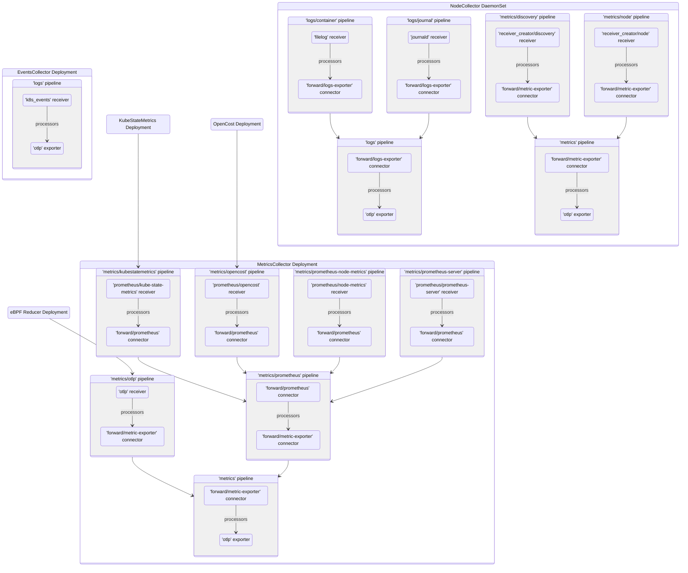

# Collector pipeline

The `swo-k8s-collector` Helm chart deploys several k8s workflows. The following chart shows dataflows inside the deployed OTEL collectors: `MetricsCollector Deployment`, `EventsCollector Deployment` and `NodeCollector DaemonSet`

Note: Some of the pipelines may not be actually utilized, depending on the environment and the Helm chart's settings provided during its installation.

